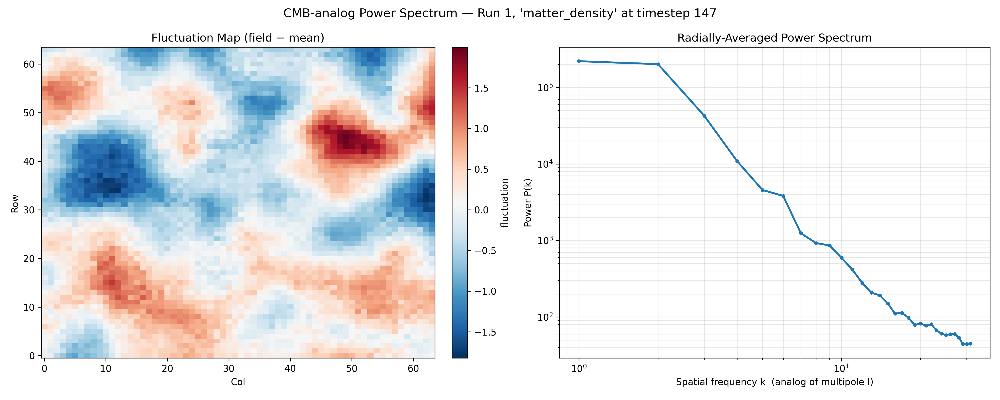

# Rip Simulation Results

A record of notable simulation results, the settings that produced them, and what they show. Unlike `run_log.md` (which tracks every tuning run), this document curates the results worth keeping and explaining.

---

## Inflation: Start, Expansion, and Graceful Exit

**Run:** 1 &nbsp;|&nbsp; **Grid:** 64×64×64 &nbsp;|&nbsp; **Timesteps:** 500

### What it shows

This is the inflation signature produced by the rip field driving cosmic expansion.

**Top panel — Cosmic Expansion:** The scale factor climbs from 1 to roughly 10¹³ (about 30 e-folds of expansion), then flattens completely and holds steady. The expansion is driven by `compute_scale_factor`, which grows the scale factor each step while the rip-derived expansion factor stays above threshold.

**Bottom panel — Expansion Rate:** The growth rate `d(ln a)/dt` is the inflation signature. It ramps up rapidly, peaks early (~1000 Myr), then decays as the rip field weakens, and drops to zero at t ≈ 11,900 Myr. **Inflation ends** — the universe stops inflating and coasts.

### Why it matters

The defining challenge for any inflation model is the **graceful exit**: inflation must stop so that a normal, structure-forming universe can follow. A model that inflates forever cannot describe our universe. This run demonstrates a clean termination — expansion ramps, sustains for a finite epoch, then shuts off.

### Known limitations

The shutoff is currently a sharp discontinuity (growth rate drops from ~0.0005 to 0 in a single timestep) rather than a smooth dynamical rolloff. This is an artifact of the hard `expansion_factor > 0.05` cutoff in `compute_scale_factor`. A future refinement could replace the hard threshold with a smooth rolloff for a more physically realistic exit.

---

## Cosmic Microwave Background Analog

### Matter Density Fluctuations

**Run:** 1 &nbsp;|&nbsp; **Grid:** 64×64×64 &nbsp;|&nbsp; **Timestep:** 147 &nbsp;|&nbsp; **Field:** matter_density (non-black-hole cells only)

### What it shows

**Left panel — Fluctuation Map:** Large-scale overdense (red) and underdense (blue) regions are clearly visible after black hole cells are excluded. The structure reflects the Perlin noise initial conditions evolved through accretion and gravitational dynamics. Coherent blobs spanning 10–20 cells are visible, consistent with the Perlin correlation length set by `PERLIN_FREQUENCY = 0.05`.

**Right panel — Power Spectrum:** A clean steep power law from k=1 to k~30, declining roughly four decades in power. More power at large scales (low k) than small scales (high k) — the expected signature of correlated initial conditions. No acoustic peaks are present, which is expected since the simulation has no baryon-photon oscillator.

### Known limitations

- Black hole cells are excluded and replaced with the non-BH mean for the FFT — col/row positions where all depth layers are black holes contribute no real signal.
- The power law slope reflects the Perlin seeding more than dynamical evolution at this timestep; a later timestep after more accretion may show more structure.
- The `matter_density` field is not mass-conserving — accretion adds matter locally without transferring it from neighbors.

---

## Matter Loss and Expansion (Phase 1 — in progress)

*(pending — testing whether total_matter drain correlates with the scale factor expansion rate)*