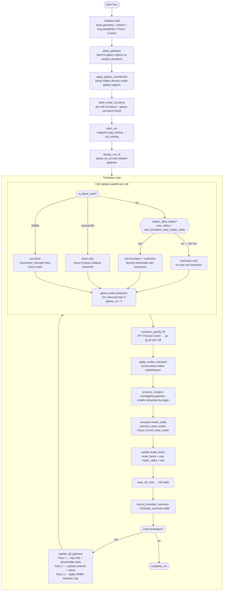
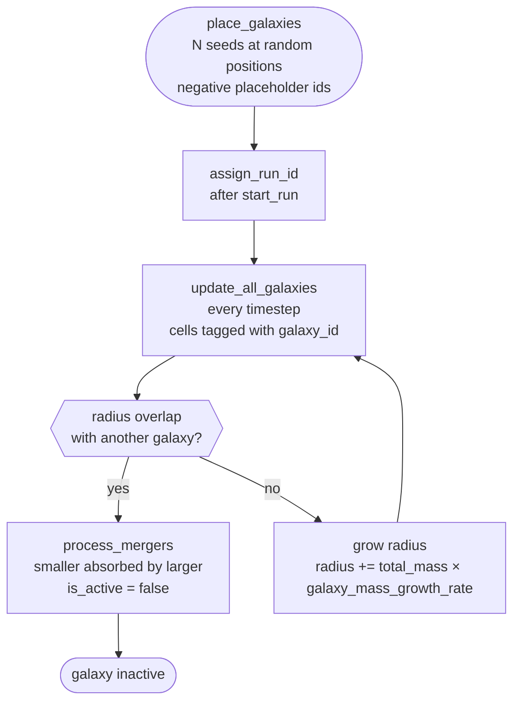

# Rip Simulation — Architecture

> **Auto-generated** by `generate_flowchart.py` — do not edit by hand.  
> Regenerated automatically by `plot.bat` after each validated run.

## Simulation Loop

## Galaxy Lifecycle

## Database Tables

Tables written by `sqlite_provider.rs`:

- `cell`
- `cell_position`
- `galaxy`
- `galaxy_timestep`
- `log`
- `run`
- `run_setting`
- `structure_particle`
- `timestep_summary`

## Active Feature Flags

| Feature | Status |
|---------|--------|
| Late-forming galaxy discovery (`discover_new`) | ✗ disabled |
| Galaxy mergers (`process_mergers`) | ✗ disabled |
| Galaxy drain protection | ✓ active |
| Star formation `matter_delta` gate | ✓ active |
| SMBH baryonic mass cap | ✓ active |
