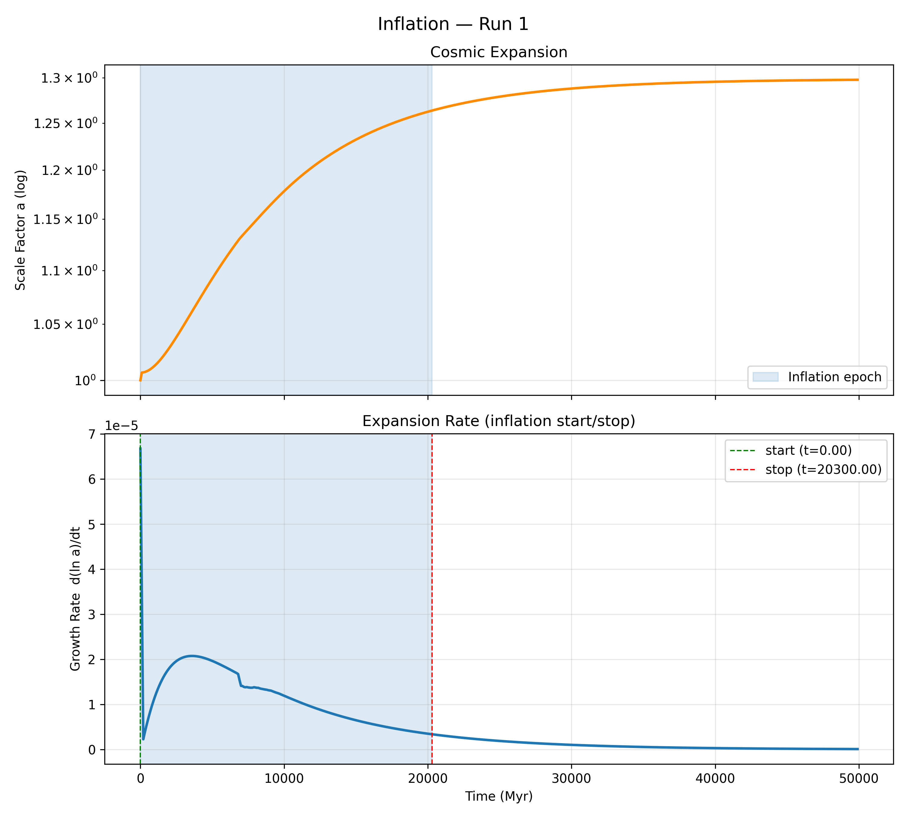
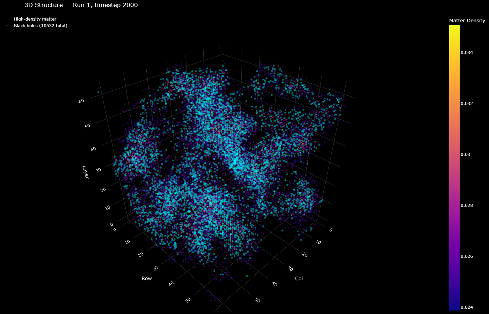
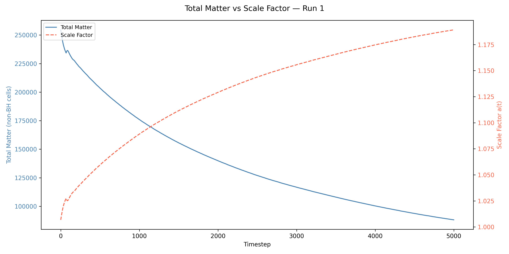

# Rip Simulation Results

A record of notable simulation results, the settings that produced them, and what they show. Unlike `run_log.md` (which tracks every tuning run), this document curates the results worth keeping and explaining.

---

## Inflation: Contraction, Expansion, and a Smooth Graceful Exit

**Run:** 1 &nbsp;|&nbsp; **Grid:** 64×64×64 &nbsp;|&nbsp; **Timesteps:** 2000

### What it shows

This is the inflation signature produced by **matter loss driving cosmic expansion**. `compute_scale_factor` was rewired from the earlier abstract rip formula to grow the scale factor in response to matter leaving the budget — drained through rips and sequestered into black holes (excluded from `total_matter`).

**Top panel — Cosmic Expansion:** The scale factor starts at 1.0, dips a couple percent below 1.0 (a brief early contraction while accretion outpaces the still-dormant rips), then turns over and climbs smoothly to ~1.30, where it plateaus and holds. The total expansion follows directly from how much matter is lost: because each step multiplies `a` by `exp(matter_delta · MATTER_EXPANSION_RATE)`, the relationship telescopes to `a(t) = exp(MATTER_EXPANSION_RATE · [M₀ − M(t)])`. The plateau at ~1.3 corresponds to nearly the entire initial matter budget having drained.

**Bottom panel — Expansion Rate:** `d(ln a)/dt` is the inflation signature. It opens with a brief negative excursion (the contraction), spikes positive as the rips activate, eases into a smooth hump (peak ~2×10⁻⁵ near 4,000 Myr), then decays to zero on its own as the matter drain exhausts. **Inflation ends** because there is nothing left to drain — a self-terminating exit at t ≈ 20,300 Myr.

### Why it matters

The defining challenge for any inflation model is the **graceful exit**: inflation must stop so a normal, structure-forming universe can follow. This run terminates cleanly — and, unlike the earlier formula-driven version, the shutoff is now a **smooth dynamical rolloff** rather than a hard cutoff. The growth rate tapers to zero as the drain runs out, not because a threshold trips.

The early **contraction** is a new feature, revealed once the artificial `max(1.0)` floor on the scale factor was removed. Before the rips activate, accretion briefly wins, matter grows, and the universe contracts ~2%; the bottom of that dip is the physics-driven onset of expansion. Contraction-before-expansion is well-trodden ground in cosmology (bouncing/cyclic models, going back to Tolman 1934), though here it arises from the matter-budget bookkeeping rather than from GR dynamics.

### Epistemic note: this result was not targeted

The inflation-like profile was not an explicit design goal. The simulation was built to model matter crossing geometric thresholds into child geometries. The scale factor was wired to respond to matter loss. The inflation shape — rapid early expansion, smooth deceleration, graceful exit — fell out without tuning for it.

This matters for evaluating the hypothesis. Standard inflation theory was constructed backwards: the inflaton field was invented specifically to produce the flatness, horizon-agreement, and monopole-dilution observations. A mechanism designed to reproduce observations is weak evidence for those observations. Rip's inflation-like curve was unsolicited. It emerges from one rule applied identically across all epochs (matter loss expands spacetime), producing epoch-appropriate behavior — fast early, slow late — without separate physics for each epoch. That unification is a stronger signal than a purpose-built fit would be.

See `decisions.md` — *Emergent inflation-like behavior as epistemic signal* — for the full principle.

### Known limitations

- The expansion is modest (~1.3×, ~0.26 e-folds) at `MATTER_EXPANSION_RATE = 1e-6` — it is bounded by the available matter budget (`exp(k · M₀)`). A larger rate scales the e-folds up.
- The scale factor is currently a **passive diagnostic**: it records the `a(t)` implied by matter loss but does not feed back to dilute densities (no ρ ∝ a⁻³). Expansion and structure are decoupled in the current model.
- *(Superseded.)* The earlier "hard discontinuity at `expansion_factor > 0.05`" limitation no longer applies — that cutoff and the abstract rip formula were replaced by the matter-loss mechanism.

---

## Matter Loss Drives Expansion

### What it shows

The scale factor is wired directly to matter leaving the budget. Because the per-step update is multiplicative-exponential, `a(t) = exp(MATTER_EXPANSION_RATE · cumulative_matter_lost)` holds exactly. The expansion at any time is therefore an analytic function of how much matter has been removed from normal spacetime — the correlation is not approximate, it is built in by construction. The substantive question is the *shape* of `total_matter(t)`, which is what gives the inflationary profile its form.

### Why it matters

This is the core hypothesis of the project: matter crossing into rips and black holes, removed from normal spacetime, is what drives expansion. The run shows the mechanism produces an inflation-like `a(t)` with a graceful exit emerging from the physics rather than imposed by a formula.

---

## Cosmic Microwave Background Analog

### Matter Density Fluctuations

**Run:** 1 &nbsp;|&nbsp; **Grid:** 64×64×64 &nbsp;|&nbsp; **Timestep:** 2000 &nbsp;|&nbsp; **Field:** matter_density (non-black-hole cells only)

### What it shows

**Left panel — Fluctuation Map:** Large-scale overdense (red) and underdense (blue) regions are clearly visible. The structure reflects the Perlin-noise initial conditions evolved through accretion and gravitational dynamics, with coherent blobs spanning 10–20 cells consistent with the Perlin correlation length.

**Right panel — Power Spectrum:** A clean steep power law from k=1 to k~30, declining roughly four decades in power. More power at large scales (low k) than small scales (high k) — the expected signature of correlated initial conditions. No acoustic peaks are present, as expected for a simulation with no baryon–photon oscillator.

### Known limitations

- Black hole cells are excluded from the field; col/row positions where all depth layers are black holes contribute no real signal.
- The slope reflects the Perlin seeding as much as dynamical evolution; matter_density is denser at t=2000 than at late times because the rip drain has not yet stripped it.
- The `matter_density` field is not mass-conserving — accretion adds matter locally without transferring it from neighbors.

### Curvature and Rip Strength

The `curvature` and `rip_strength` fields are noise-dominated by contrast: both spectra fall off the k=1 mode and flatten into a white-noise floor with no long-range coherence. This is expected — these fields are set locally, whereas `matter_density` is the only field acted on directly by the FFT gravity solver, so it is the only one that develops large-scale structure.

---

## Large-Scale Structure

### 2D Matter Density Map

**Run:** 1 &nbsp;|&nbsp; **Grid:** 64×64×64 &nbsp;|&nbsp; **Timestep:** 2000 &nbsp;|&nbsp; **Field:** matter_density (non-BH cells only)

### What it shows

**Left panel — Matter Density Projection:** The maximum matter density along the depth axis projected onto a 2D map. Overdense regions (yellow/orange) are separated by underdense voids (dark), with distinct dense nodes and filament-like connections between them. The structure is gravitational accretion acting on the Perlin initial conditions.

**Right panel — Density Distribution:** The histogram at t=2000 with filament (top 30%, ~0.128) and void (bottom 30%, ~0.087) thresholds marked. The distribution is unimodal — a consequence of the roughly uniform drain acting on all cells. Real cosmic structure would show a more bimodal distribution as gravity amplifies overdensities over longer timescales.

### 3D Interactive Visualization

**[Open interactive 3D view](structure_3d_run1_t2000.html)** — rotate, zoom, and explore the matter density distribution in three dimensions.

**Run:** 1 &nbsp;|&nbsp; **Grid:** 64×64×64 &nbsp;|&nbsp; **Timestep:** 2000 &nbsp;|&nbsp; **Density percentile:** top 5%

### What it shows

High-density matter cells (colored by density, Plasma colorscale) rendered in 3D, with clear clustering and emptier regions between clumps — consistent with gravitational collapse concentrating matter in overdense regions.

### Known limitations

- The 64³ grid is too coarse to resolve filament width reliably — a 512³ production run would show much finer structure.
- Accretion is local (no mass transfer between cells), so filaments form from initial Perlin overdensities amplified by gravity rather than from true matter flow along filaments.

---

## Black Hole Reversal (added — verification pending)

Black holes can now relax back into ordinary cells once they drain below half their formation threshold (with hysteresis), the counterpart to formation. A dedicated `bh_drain_rate` acts as the clock that sets black-hole lifetime; on reversal the residual matter re-enters `total_matter`, which is intended to register as a contraction. The goal is to turn the single early contraction into a train of contract/expand cycles, with the matter budget shrinking each cycle.

**Status:** The current inflation curve (Run 1, 2000 timesteps) does **not** yet show clear multi-cycle oscillation — only the single opening dip, with one small kink in the growth rate near 6,500 Myr. Whether reversal is firing but desynchronized, or not firing at all, is being verified directly from the `black_hole_count` time series in `timestep_summary` (a count that rises *and falls* confirms reversal). This section will be completed once that is confirmed.

---

## Notes on This Run

- Two correctness fixes preceded this run: a copy-paste bug that doubled `scale_factor`/`rip_strength_avg` in the timestep summary, and the removal of the `max(1.0)` floor on the scale factor (which had been hiding the early contraction).
- The `1e30` black-hole sentinel for `matter_density` was removed; black hole cells now carry their real matter, which is what makes reversal accounting and a clean gravity FFT possible.

---

### Matter transport and structure formation

Conservative two-pass, gravity-driven matter transport (`helpers/transport.rs`) replaced the
broken non-conservative accretion term. With `transport_rate = 0.025`, matter clusters under its
own gravity into a cosmic web — filaments, nodes, and voids — with a red (large-scale-weighted)
matter power spectrum. Higher rates (0.05) over-concentrate into isolated spikes. Transport is a
**one-way concentrator**: matter only flows downhill, so the rate sets the *timescale* of clumping,
not its final degree.

### Black-hole formation is transport-sustained

The earlier "Black holes created: 0" was a *survivor* count at the final timestep, not a cumulative
count. True arc: a synchronized formation wave at t=0, a synchronized reversal wave as those holes
drain below threshold (early, ~t≈7000 Myr in the inflation plot), then settling. Without transport,
the count drops to zero and stays there. With transport, surviving matter re-clusters and
re-collapses, so the population persists (re-formation).

### Headline result: a(t) responds to the black-hole channel only when the diffuse drain is subdominant

a(t) = exp(k · matter_lost). With the diffuse rip drain at `rip_drain_rate = 1.25e-6` (effective
~1.2%/cell/step after ×rip_strength), the leak dominates the matter budget and a(t) is
**byte-identical across every configuration** (transport on/off, web/spikes, holes/none) — a smooth
monotonic ramp to ~1.3. The leak is a *one-way* channel, so a(t) is monotonic by construction and no
black-hole dynamics can bend it.

Lowering `rip_drain_rate` to `1.25e-8` (~100×) puts the black-hole channel in charge of the matter
budget. Result (64³, 500 steps):

- ~5114 black holes survive to t=499 (vs 19 under the strong drain), core densities ~430.
- a(t) breaks from the ~1.3 ramp down to ~1.058 and, critically, shows a **contraction** —
  d(ln a)/dt goes negative — coinciding with the first reversal wave.

This is the first demonstration that the reversal channel can bend a(t) negative: matter into holes
expands a(t), matter re-injected from reverting holes contracts it. The core mechanism, on screen.

**Caveat:** one pulse, not a sustained cycle. After the first synchronized wave the population
de-phases (cells form and revert at staggered times) and a(t) settles into a gentle climb. Sustained
cycling needs a re-synchronizing driver, not a parameter tweak (see ideas-to-explore).

**Reproducing recipe:** `transport_rate = 0.025`, `rip_drain_rate = 1.25e-8`, curvature = random
seed (`rng 0.0..0.1`), `curvature_threshold = 0.08`, `collapse_density_threshold = 1.5`, accretion
removed, gravity write-back active, straight axis pairing.
---

## Phase 1 Confirmed: Matter Loss Correlates with Expansion

**Run:** 1 &nbsp;|&nbsp; **Grid:** 64×64×64 &nbsp;|&nbsp; **Timesteps:** 5000

### What it shows

A direct plot of `total_matter` (non-BH cells only, left axis) against `scale_factor` (right axis) over the full run. The two curves are mirror images: as matter falls into black holes and leaves normal spacetime, the scale factor rises in lockstep.

Key features:

- **Early spike (t < 2000):** The initial BH formation wave drives a sharp drop in total matter and a corresponding fast rise in scale factor — the bulk of the expansion happens here.
- **Matched deceleration:** Both curves flatten at the same rate after ~t=1000, consistent with expansion being driven by the *rate* of matter loss — as d(matter)/dt slows, so does d(a)/dt.
- **Clean anti-correlation throughout:** The relationship holds across all 5000 timesteps without divergence or anomaly.

### Why it matters

This is the Phase 1 hypothesis test: does matter loss from normal spacetime correlate with expansion? The answer is unambiguous — yes, and the shape of the correlation is exactly what the mechanism predicts. The scale factor is not being driven by an abstract formula; it tracks the matter budget directly.

This result justifies proceeding to Phase 2: rewiring `compute_scale_factor` to use −d(total_matter)/dt as its direct input, replacing the current per-cell average.

### Next step

Phase 2 — rewire `compute_scale_factor` to derive expansion rate from `−d(total_matter)/dt` computed from `timestep_summary`, making the matter-loss-drives-expansion mechanism explicit rather than implicit.
---

## Supermassive Black Holes: Heavy-Tailed Overmassive Population from Threshold-Crossing

**Run:** 1 &nbsp;|&nbsp; **Grid:** 64×64×64 &nbsp;|&nbsp; **Timesteps:** 5000 &nbsp;|&nbsp; **Mode:** `tied_to_curvature`

### What it shows

This targets the JWST anomaly of overmassive early black holes — black-hole-to-stellar-mass ratios of 10–30% at high redshift versus ~0.1–0.5% locally — where instantaneous threshold-crossing collapse has a natural edge over slow accretion. SMBHs form from rare high-curvature seeds that cross a higher threshold than ordinary black holes (`smbh_curvature_threshold`), with formation probability biased toward early timesteps (`exp(−t / smbh_early_bias)`). Once formed, each SMBH feeds from the parent geometry at its own **connection strength**, drawn heavy-tailed at formation: most SMBHs get a near-zero feed and stall near drain-balance; a rare few get a strong connection and run away to overmassive scale. Persistence is a consequence of net-positive growth (connection exceeding `bh_drain_rate`), not an imposed exemption from reversal.

**Left panel — mass distribution:** A textbook heavy tail. A large spike of stalled SMBHs sits near the formation floor, with a long declining tail stretching across many orders of magnitude to the runaway giants. The population is overwhelmingly small holes with a rare overmassive minority — qualitatively the JWST regime, where most black holes are unremarkable and a few are anomalously large for their epoch.

**Right panel — connection strength versus mass, colored by formation curvature:** A sharp threshold at the drain rate (~10⁻²): below it every SMBH is stalled flat along the mass floor, above it mass climbs near-vertically. The runaway points are uniformly high-curvature (bright), while the stalled floor is mixed — the visual signature of the curvature-mass correlation that the `tied_to_curvature` mode produces.

### The two connection modes are empirically distinguishable

The connection-strength assignment is a pluggable mode (`SmbhConnectionMode`), allowing the curvature-tied and independent hypotheses to be compared directly. Splitting SMBHs into runaway (mass > 1000) and stalled groups and comparing their formation curvature:

| Mode | Runaway curvature | Stalled curvature | Correlation |
|------|-------------------|-------------------|-------------|
| `tied_to_curvature`  | 0.0989 | 0.0974 | present |
| `independent_draw`   | 0.0975 | 0.0975 | absent |

In the curvature-tied mode the SMBHs that ran away are those that formed in deeper curvature wells; in the independent mode the giants and the stalled holes are drawn from the same curvature distribution. Both modes produce the same heavy-tailed overmassive population, so the JWST anomaly itself does not distinguish them — but the curvature-mass correlation does.

### Why it matters

The mechanism reproduces the qualitative JWST signature without slow accretion: instantaneous threshold-crossing plus a rare strong parent-geometry feed produces overmassive holes early and fast. More usefully, the mode comparison yields a **falsifiable observational test**: under the rip hypothesis with curvature-tied connection, observed SMBH masses should correlate with the curvature of their formation environment; under independent connection, they should not. This is checkable in principle against the relationship between SMBH mass and host-galaxy/halo properties.

### Known limitations

- **Unbounded growth.** With connection strength exceeding the drain rate, runaway SMBH mass grows geometrically each step (`(1 + connection − drain) × density`), reaching unphysical magnitudes over 5000 steps. The *distribution shape* is the result here, not the absolute mass values; a physical cap or a finite, drawn-down supply is needed before the absolute scale is meaningful. This is the same conservation question recorded in `decisions.md` — the parent-inflow term creates matter from nothing within the single modeled geometry.
- **Population count.** ~12,800 SMBHs form, far more than the one-per-galaxy of reality. Because growth is now decoupled from formation (most seeds stall), the effective population is a handful of giants among many stalled small holes, but the raw seed count is still high. Tying formation (not just growth) to a rarer condition — or to the future galaxy structures — would bring the count toward realism.
- **No feedback to structure.** As with the inflation result, SMBH mass does not yet feed back into the gravity field or dilute surrounding densities.

### Next step

The galaxy branch: model galaxy-scale overdensity regions, place SMBHs at their centers, and tie the parent-connection strength (and ideally formation itself) to host properties. That would convert the high seed count into a realistic one-SMBH-per-galaxy population and open the SMBH↔galaxy rip-feedback question.