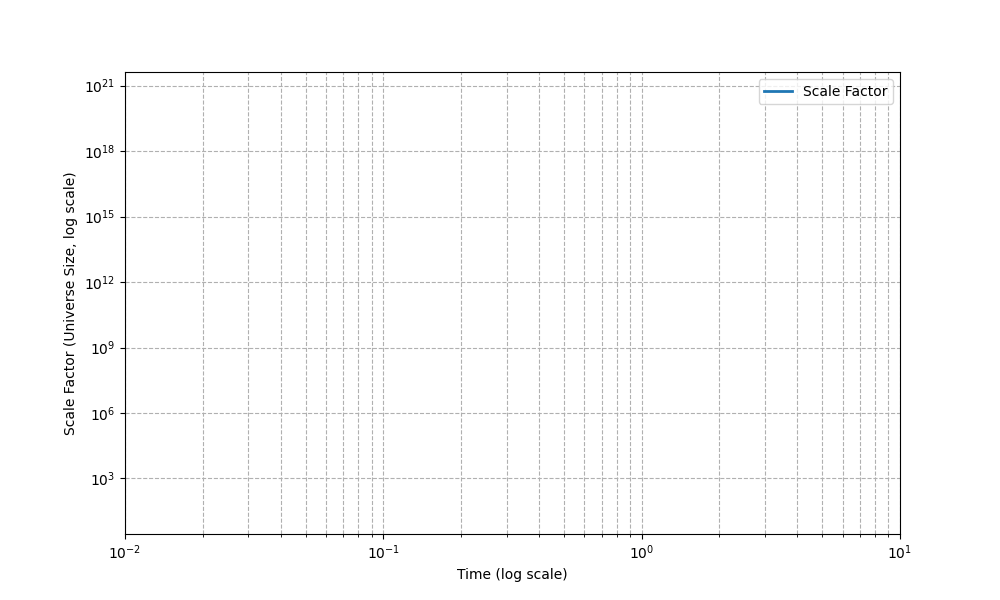

# Rip Field Cosmology: A Unified Approach to Inflation and Dark Energy

## 1. Introduction

### Brief description of the rip field concept

In this model, we introduce the concept of a **rip field**: an external field associated with a slow, cumulative loss of matter and energy from the universe. Unlike traditional dark energy models that attribute accelerated expansion to a constant vacuum energy, the rip field represents a subtle, persistent erosion of the fabric of spacetime itself. As matter and energy are gradually "ripped" away, the density of the universe decreases, altering its expansion behavior over time.

The rip field is a theoretical tool to explore how small-scale mass loss might accumulate to produce large-scale cosmological effects. Its evolution is characterized by simple physical laws in two distinct regimes: an **initial decay** during the early universe (inflation phase) and a **gradual growth** dominating the late universe (dark energy phase).

### Why we are exploring this: inflation, dark energy, and cosmic evolution

The standard cosmological model requires two distinct periods of accelerated expansion:
- **Inflation**: a rapid early expansion shortly after the Big Bang.
- **Dark energy-driven acceleration**: beginning billions of years later and continuing today.

Both phases are explained by different mechanisms in standard theory, but remain deeply mysterious.

The rip field model offers a single underlying mechanism — matter and energy loss — that could potentially contribute to **both** periods of cosmic acceleration. By tuning the behavior of the rip field across time, it may be possible to link early-universe inflation and late-time dark energy into a unified framework.

Additionally, this approach provides a natural way to explain the apparent "coincidence problem" — why dark energy becomes important only billions of years after the Big Bang — without fine-tuning a constant vacuum energy.

The goal of this simulation is to explore whether a simple model of the rip field evolution can reproduce key observational features of cosmic history:
- Rapid inflation
- Slower expansion dominated by matter
- Late-time accelerated expansion matching observed Hubble data

---

## 2. Simulation Methodology

We simulate the rip field evolution across cosmic time in two primary regimes:

- **Early universe (inflation)**: a rapid initial decay phase representing extreme early-time expansion.
- **Late universe (dark energy era)**: a slow growth phase as the rip field accumulates strength over billions of years.

### Simulation Setup

The simulation is divided into two projects:
- `rip-inf` (inflation phase simulation)
- `rip-de` (dark energy phase simulation)

Supporting functionality is shared through `rip-core`.

Simulations are written in Rust, using Rayon for parallelism and simple CSV output for analysis.

### Key Constants (Dark Energy Phase)

| Constant | Value | Meaning |
|:--|:--|:--|
| `INITIAL_MASS` | 1.0e12 solar masses | Mass of each galaxy |
| `INITIAL_BH_MASS` | 1.0e8 solar masses | Initial black hole mass |
| `NUM_GALAXIES` | 1,000,000 | Number of galaxies per run |
| `SIM_DURATION` | 13,800 Myr | Duration (age of universe) |
| `TIME_STEP` | 100 Myr | Time step resolution |
| `NUM_RUNS` | 50 | Independent runs averaged |
| `NUM_CORES` | -1 | Use all available CPU cores |
| `W_DARK_ENERGY` | -1.0 | Dark energy equation of state |
| `MATTER_FADEOUT_TIME_MYR` | 5000.0 Myr | Matter density fadeout cutoff |

### Assumptions

- Matter inflow into black holes is random per galaxy.
- Rip events probabilistically occur based on black hole mass and time.
- The rip field strength grows cumulatively with each rip event.
- The scale factor evolves based on the strength of the rip field.
- Matter becomes negligible after 5 Gyr, after which rip-field effects dominate.

### Outputs

Simulation outputs:
- CSV files for each run (`run_0.csv`, `run_1.csv`, etc.)
- Columns: `time_myr`, `rip_strength`, `scale_factor`

Plots and fitted models are generated by Python scripts using Matplotlib and SciPy.

---

## 3. Results Overview

*(to be added after discussion: summary of plots and main features)*

---

## 4. Discussion and Future Work

*(to be expanded after final simulations are run and plots interpreted)*

Possible extensions:
- Higher number of runs for better noise reduction.
- Variable w models (ω ≠ -1) to simulate evolving dark energy.
- Adding matter and radiation explicitly back into expansion calculations.

---

## 5. Conclusion

*(to be written after results and discussions are finalized)*

---

# Table of Figures

---

**Figure 1. Rip Field — 1 Million Galaxies**

> Evolution of the rip energy density over cosmic time across multiple simulation runs. Shows rapid early inflation and late-time acceleration compared to ΛCDM dark energy density.

---

**Figure 2. Rip Field — 20k Galaxies**

> Higher resolution view of initial galaxy formation and early rip field fluctuations using a reduced dataset.

---

**Figure 3. Rip Field — All Normalized**

> Normalized rip field energy densities showing consistent inflationary behavior and minor variance across multiple runs.

---

**Figure 4. Rip Field Derivative**

> First derivative of rip field energy density over time, highlighting phases of rapid inflation, stabilization, and late-time acceleration.

---

**Figure 5. Rip Field Fit**

> Best-fit model to the rip field behavior, supporting the hypothesis of dynamic inflation followed by long-term stabilization.

---

**Figure 6. Rip Field Mean and Standard Deviation**

> Statistical analysis of rip field simulations showing mean behavior with ±1σ standard deviation bounds.

---

**Figure 7. Rip Field Overlay**

> Overlay of multiple rip field simulation runs demonstrating strong consistency and predictability in inflationary growth patterns.

---

**Figure 8. Rip Field Second Derivative**

> Curvature (second derivative) of the rip field over time, indicating changes in the acceleration rate of inflation.

---

**Figure 9. Rip Field vs H(z) Observations**

> Comparison between simulated expansion rates and observational Hubble parameter \(H(z)\) data. General trends are consistent within uncertainty.

---

**Figure 10. Grid Search Heatmap (Fit Parameters)**

> Heatmap showing optimization results from parameter grid search fitting simulation data to observational constraints.

---

**Figure 11. Inflation Animation Snapshot**

> Frame capture from animation showing rapid early universe inflation and transition to steady-state expansion.

---

**Figure 12. Scale Factor and Inflation End**

> Evolution of the cosmological scale factor highlighting inflation endpoint and onset of slower expansion.

**Figure 13. Combined Scale Factor Plot**

> Combined plot showing the evolution of the cosmological scale factor across inflation, stabilization, and late-time acceleration phases, tying together the overall expansion history.

---

