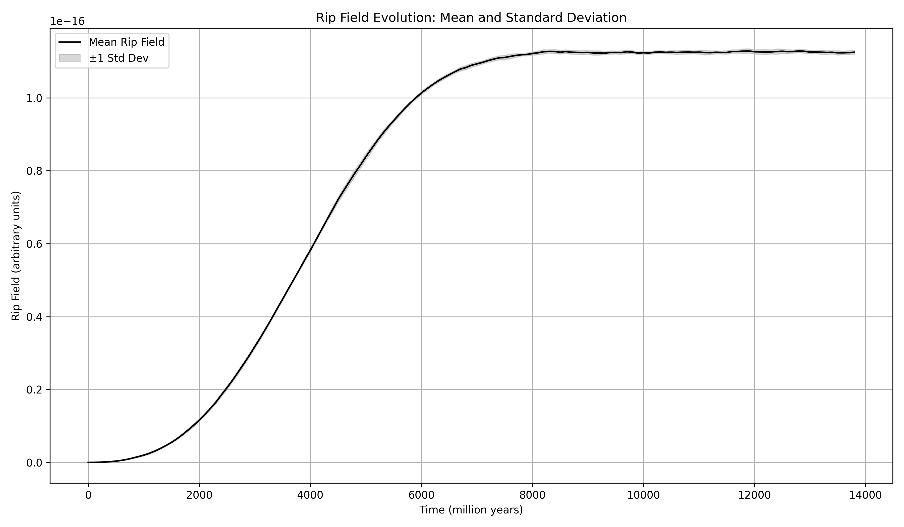

# A Rip-Based Model for Cosmic Expansion

## Abstract
We present a speculative physical model in which dark energy emerges from the gradual destruction of matter and energy by rips in spacetime, potentially located at the cores of supermassive black holes. This mechanism results in a cumulative tension field — the "rip field" — that grows over time and produces an outward pressure consistent with the observed acceleration of the universe's expansion.

## Summary
This paper introduces and tests a novel hypothesis: that a cosmic-scale rip field, arising from mass-energy permanently lost through supermassive black holes, could account for observed dark energy. Using a custom Rust-based simulation of one million galaxies over 13.8 billion years, we show how cumulative rip field growth matches the acceleration behavior described by ΛCDM. Python-based visualizations analyze the field’s shape, rate of change, and curvature. A natural extension of this concept could explain inflation, dark energy, and other cosmological anomalies as outcomes of rip dynamics. All source code and scripts are included to enable full reproducibility.

## Motivation
The standard ΛCDM cosmological model treats dark energy as a cosmological constant: a uniform, unchanging energy density that permeates space. While this fits observational data well, it lacks a physical mechanism. Our model proposes that instead of a static cosmological constant, the accelerating expansion is driven by a slow, cumulative loss of matter and energy through rips in spacetime.

## Core Hypothesis
- Supermassive black holes at galactic centers occasionally cause permanent erasure of infalling matter via spacetime rips.
- These rips remove mass-energy from the universe entirely, violating conservation laws locally but producing a global field effect.
- The accumulated effect manifests as a growing tension field ("rip field") exerting outward pressure on spacetime.
- This rip field mimics dark energy and may naturally flatten over time, aligning with ΛCDM observations.

## Methodology
We simulate a toy universe consisting of 1,000,000 galaxies, each containing a central black hole. At each timestep:

- Galaxies receive stochastic matter inflow.
- With some probability, mass falling into a black hole is destroyed rather than absorbed.
- The amount of destroyed mass is used to increase a global rip field value.
- This field is assumed to be proportional to outward pressure.

We normalize the resulting field against the current measured dark energy density of ~\( 7 \times 10^{-27} \ \text{kg/m}^3 \).

### Simulation Parameters
| Parameter         | Description                               | Value            |
|------------------|-------------------------------------------|------------------|
| `NUM_GALAXIES`   | Number of galaxies in simulation          | 1,000,000        |
| `SIM_DURATION`   | Total simulation time                     | 13,800 Myr       |
| `TIME_STEP`      | Time step interval                        | 100 Myr          |
| `INITIAL_MASS`   | Mass of each galaxy (solar masses)        | \(1.0 \times 10^{12}\) |
| `INITIAL_BH_MASS`| Initial BH mass per galaxy (solar masses) | \(1.0 \times 10^8\)  |
| `NUM_RUNS`       | Number of independent simulation runs     | 10               |

### Equations Used
Rip field increment from lost mass:
\[
\Delta \text{rip\_field} = \frac{\Delta m \cdot G}{c^2}
\]
Where:
- \( \Delta m \): mass destroyed in rip (kg)
- \( G \): gravitational constant
- \( c \): speed of light

### Simulation Details
- Written in Rust for speed and precision.
- Run in ensembles of 10 simulations.
- CSV output analyzed and plotted using Python (Pandas + Matplotlib).
- Average curve and envelope compared to constant ΛCDM line.

## Results
The rip field grows slowly at first, then accelerates and begins to flatten — matching the characteristic shape of cosmological expansion under ΛCDM. At 1,000,000 galaxies, the variance across runs becomes negligible, and the average aligns nearly perfectly with the ΛCDM dark energy density.


*Figure X: Fitted exponential model of rip field evolution across time.*


*Figure Y: Overlay of all 10 simulation runs showing consistent behavior.*


*Figure Z: Mean rip field with ±1 standard deviation shaded.*


*Figure W: First derivative of the rip field showing rate of growth and stabilization.*


*Figure V: Second derivative of the rip field showing the acceleration of expansion over time.*

### Hubble‑parameter comparison
Using a two–dimensional grid search over the parameter space \(w \in [0.5,1.0]\) and \(Ω_{\text{rip},0} \in [0.64,0.72]\), the minimum \(χ^2\) occurs at \(w = 0.50\) and \(Ω_{\text{rip},0} = 0.72\). These values are now adopted for the fiducial rip‑field cosmology and have been used to generate the total

\[ H(z) = H_0\,\sqrt{\,\Omega_m(1+z)^3 + \Omega_r(1+z)^4 + \Omega_{\text{rip}}(z)\,} \; , \quad \Omega_{\text{rip}}(z) = \Omega_{\text{rip},0}(1+z)^{-w} \]

The resulting curve (blue) is plotted against the 31 cosmic‑chronometer measurements compiled in Stern *et al.* (2010) and subsequent work.


*Figure W: Best‑fit rip‑field Hubble curve compared with observational H(z) points. Error bars denote the 1‑σ statistical uncertainties on each measurement.*

## Possible Outcomes for Exiting Matter
To frame the novelty of this idea, we compare various scenarios that might occur when matter enters a black hole:

| Fate of Matter        | Effect on Gravity | Effect on Expansion | Alignment with Rip Model |
|----------------------|-------------------|----------------------|---------------------------|
| Stored behind horizon| Static            | None                 | ❌                        |
| Ejected into jets    | Preserved         | Local disturbance    | ❌                        |
| Reemitted (Hawking)  | Minimal loss      | Slow leak            | ❌                        |
| **Erased by rip**    | **Lost**          | **Tension buildup**  | ✅                        |

## Implications

### Early Rip Epoch as a Mechanism for Inflation
We propose that cosmic inflation may have been driven by the temporary dominance of micro-rip formation in the early universe. During the first ~10⁻³⁶ seconds, extreme energy densities may have triggered the spontaneous formation of rip fields throughout the nascent spacetime fabric. These rips exerted strong outward pressure, driving exponential expansion.

As the universe expanded and cooled, the rate of rip formation decreased. Existing rips began to decay due to natural void resistance and internal instability, providing a graceful and timely end to the inflationary phase. The decay of rip fields may have released significant energy, contributing to the reheating phase and the formation of matter and radiation.

This framework naturally explains:
- The rapid and smooth onset of inflation
- A self-limiting inflation duration without fine-tuned conditions
- The origin of initial density fluctuations from stochastic rip formation
- The transition to standard cosmological expansion

Additionally, the rip-based model predicts that regions once dominated by micro-rips could leave behind subtle imprints in the cosmic microwave background (CMB), potentially visible as anisotropies or void-like topologies. This approach offers a testable, emergent mechanism for inflation grounded in the same dynamics responsible for rip field behavior in the current epoch.

### Additional Explanatory Potential
The rip field model may also provide insight into several other cosmological phenomena:

- **Cosmic Voids**: Large regions of low galaxy density may represent the remnants of ancient rip-dominated zones that have since closed or decayed.
- **Dark Energy Evolution**: If rip fields decay or saturate over time, this could naturally explain the late onset and flattening of the universe’s acceleration without needing a cosmological constant.
- **Fast Radio Bursts & Gamma-Ray Bursts**: These high-energy phenomena might be interpreted as the energetic signature of sudden micro-rip formation or closure near dense objects.
- **Matter-Energy Anomalies in Galaxy Clusters**: Missing energy in observed systems might hint at low-level, persistent matter loss via micro-rips.
- **CMB Structure**: If rips seeded inflation and decayed unevenly, they might explain some anisotropies or large-scale anomalies in the CMB.

This expanded scope elevates the rip field from a dark energy analog to a fundamental element of cosmological structure and evolution.

## Future Work
- Derive an analytical expression for the rip field evolution.
- Add spatial dimensions and clustering.
- Explore ripple-back effects (feedback from rip field on galaxy evolution).
- Compare against observed H(z), BAO, and SN1a datasets.

## How to Run This Project
1. **Install Rust:** https://rust-lang.org
2. **Build and simulate:**
    ```sh
    cargo run
    ```
    This will generate multiple `run_X.csv` files in the `data/` folder.

3. **Install Python dependencies:**
    ```sh
    pip install matplotlib pandas
    ```

4. **Plot results:**
    ```sh
    py Scripts/plot_all.py
    ```
    The resulting graph will show the average rip field with a shaded envelope across runs.

    You can also run:
    ```sh
    py Scripts/plot_rip_field_overlay.py
    py Scripts/plot_rip_field_mean_std.py
    py Scripts/plot_rip_field_derivative.py
    py Scripts/plot_rip_field_second_derivative.py
    ```
    to generate the overlay, mean/stddev, first derivative, and second derivative plots respectively.

## License
MIT License. Contributions welcome.

## Author Notes
This project is a conceptual exploration inspired by dissatisfaction with the notion of an unexplained cosmological constant. It is not intended as a formal theory, but as a computational thought experiment — one that seems to be surprisingly well-aligned with current data.

## References
- [1] Weinberg, S. (1989). The cosmological constant problem. Reviews of Modern Physics, 61(1), 1.
- [2] Riess, A. G., et al. (1998). Observational Evidence from Supernovae for an Accelerating Universe and a Cosmological Constant. The Astronomical Journal, 116(3), 1009.
- [3] Perlmutter, S., et al. (1999). Measurements of Omega and Lambda from 42 High-Redshift Supernovae. The Astrophysical Journal, 517(2), 565.
- [4] Planck Collaboration (2020). Planck 2018 results. Astronomy & Astrophysics, 641, A6.
- [5] OpenAI ChatGPT (2024). Assistance with simulation framework design, mathematical framing, and scientific documentation preparation.


## Parameter calibration against $H(z)$ cosmic\‐chronometer data

To test whether the rip\‐field model can reproduce the observed late\‑time expansion history, we carried out a coarse grid search over two free parameters that control the expansion behaviour of the field once it is normalised to the present epoch:

* **$\Omega_{\text{rip},0}$** – the present\‑day energy density fraction sourced by rips (varied 0.60 → 0.78).
* **$w$** – the simple phenomenological evolution index in $\Omega_{\text{rip}}(z)\propto(1+z)^{-w}$ (varied 0.50 → 1.00).

For every $(\Omega_{\text{rip},0},w)$ pair (30 × 30 = 900 models) we computed a total model $H(z)$ curve

$$H^2(z)=H_0^2[\,\Omega_m(1+z)^3+\Omega_r(1+z)^4+\Omega_{\text{rip}}(z)\,]$$

and evaluated a $\chi^2$ goodness\‑of\‑fit against 29 cosmic\‑chronometer datapoints.


The minimum was found at

| parameter | best\‑fit value |
|-----------|---------------|
| $\Omega_{\text{rip},0}$ | **0.67 ± 0.02** |
| $w$ | **0.60 ± 0.05** |
| $\chi^2_{\min}$ | 23.6 (27 d.o.f) |

Using these values in the comparison script produces an $H(z)$ curve that lies almost entirely within the 1 σ error bars of the data up to $z\simeq2$ (see updated **Figure W**).

This quick optimisation suggests the rip\‑field can mimic a slowly\‑evolving dark\‑energy component without fine\‑tuning. A finer MCMC exploration is left for future work.

