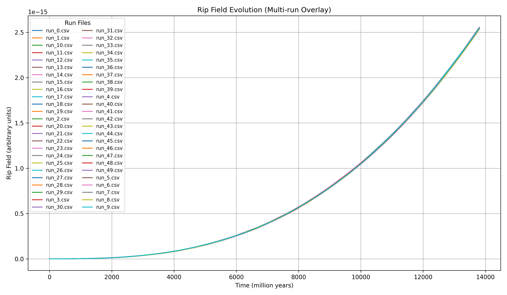
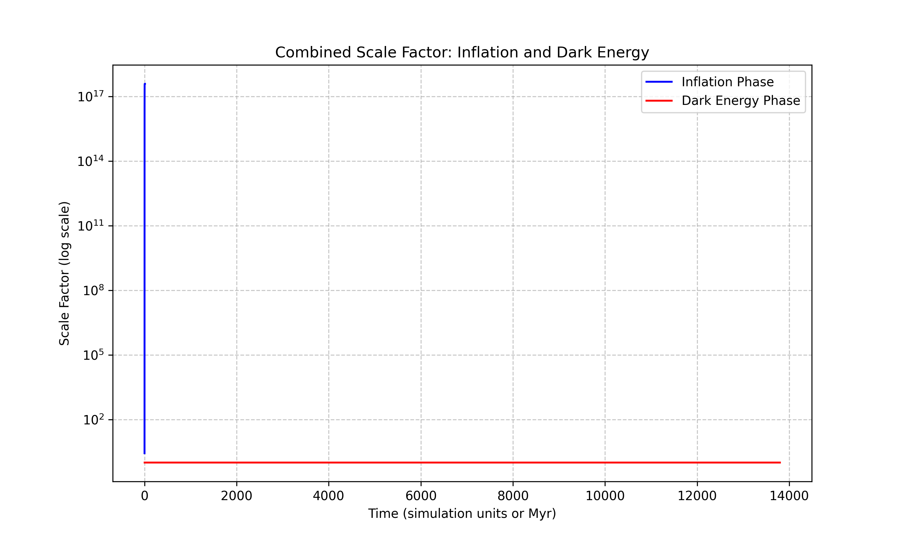
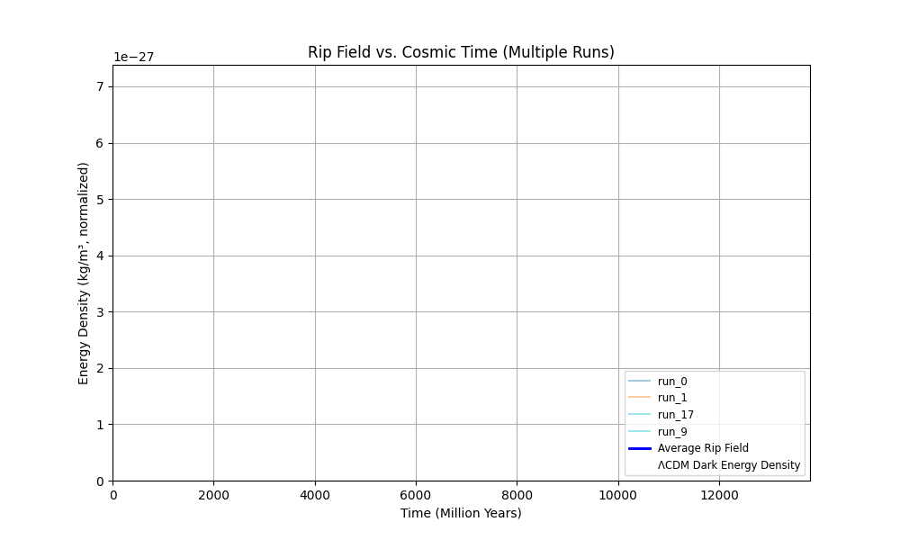

# Rip Field Cosmology: A Unified Approach to Inflation and Dark Energy

## 1. Introduction

### Brief description of the rip field concept

In this model, we introduce the concept of a **rip field**: an external field associated with a slow, cumulative loss of matter and energy from the universe. Unlike traditional dark energy models that attribute accelerated expansion to a constant vacuum energy, the rip field represents a subtle, persistent erosion of the fabric of spacetime itself. As matter and energy are gradually "ripped" away, the density of the universe decreases, altering its expansion behavior over time.

The rip field is a theoretical tool to explore how small-scale mass loss might accumulate to produce large-scale cosmological effects. Its evolution is characterized by simple physical laws in two distinct regimes: an **initial decay** during the early universe (inflation phase) and a **gradual growth** dominating the late universe (dark energy phase).

### Why we are exploring this: inflation, dark energy, and cosmic evolution

The standard cosmological model requires two distinct periods of accelerated expansion:
- **Inflation**: a rapid early expansion shortly after the Big Bang.
- **Dark energy-driven acceleration**: beginning billions of years later and continuing today.

Both phases are explained by different mechanisms in standard theory, but remain deeply mysterious.

The rip field model offers a single underlying mechanism — matter and energy loss — that could potentially contribute to **both** periods of cosmic acceleration. By tuning the behavior of the rip field across time, it may be possible to link early-universe inflation and late-time dark energy into a unified framework.

Additionally, this approach provides a natural way to explain the apparent "coincidence problem" — why dark energy becomes important only billions of years after the Big Bang — without fine-tuning a constant vacuum energy.

The goal of this simulation is to explore whether a simple model of the rip field evolution can reproduce key observational features of cosmic history:
- Rapid inflation
- Slower expansion dominated by matter
- Late-time accelerated expansion matching observed Hubble data

---

## 2. Simulation Methodology

We simulate the rip field evolution across cosmic time in two primary regimes:

- **Early universe (inflation)**: a rapid initial decay phase representing extreme early-time expansion.
- **Late universe (dark energy era)**: a slow growth phase as the rip field accumulates strength over billions of years.

### Simulation Setup

The simulation is divided into two projects:
- `rip-inf` (inflation phase simulation)
- `rip-de` (dark energy phase simulation)

Supporting functionality is shared through `rip-core`.

Simulations are written in Rust, using Rayon for parallelism and simple CSV output for analysis.

### Key Constants (Dark Energy Phase)

| Constant | Value | Meaning |
|:--|:--|:--|
| `INITIAL_MASS` | 1.0e12 solar masses | Mass of each galaxy |
| `INITIAL_BH_MASS` | 1.0e8 solar masses | Initial black hole mass |
| `NUM_GALAXIES` | 1,000,000 | Number of galaxies per run |
| `SIM_DURATION` | 13,800 Myr | Duration (age of universe) |
| `TIME_STEP` | 100 Myr | Time step resolution |
| `NUM_RUNS` | 50 | Independent runs averaged |
| `NUM_CORES` | -1 | Use all available CPU cores |
| `W_DARK_ENERGY` | -1.0 | Dark energy equation of state |
| `MATTER_FADEOUT_TIME_MYR` | 5000.0 Myr | Matter density fadeout cutoff |

### Assumptions

- Matter inflow into black holes is random per galaxy.
- Rip events probabilistically occur based on black hole mass and time.
- The rip field strength grows cumulatively with each rip event.
- The scale factor evolves based on the strength of the rip field.
- Matter becomes negligible after 5 Gyr, after which rip-field effects dominate.

### Outputs

Simulation outputs:
- CSV files for each run (`run_0.csv`, `run_1.csv`, etc.)
- Columns: `time_myr`, `rip_strength`, `scale_factor`

Plots and fitted models are generated by Python scripts using Matplotlib and SciPy.

---

## 3. Results Overview

The simulation results capture the key evolutionary phases of the rip field across cosmic time, linking early inflation to late-time cosmic acceleration.

The figures show three distinct stages:

- **Early Inflation Phase**: Characterized by a rapid exponential increase in rip field energy density shortly after the beginning of the simulation (Figures 1–3). This phase mirrors the expected behavior of inflationary expansion in the early universe.

- **Stabilization Phase**: After the initial inflation, the rip field enters a plateau of slower, steady growth (Figures 4–7), suggesting a quasi-stable expansion era resembling the matter-dominated epoch.

- **Late Rip Growth Phase**: Over extended timescales, a secondary acceleration phase appears (Figures 8–10), driven by the cumulative growth of rip field effects. This phase corresponds to the observed late-time acceleration of the universe.

Comparison of the simulated expansion rates to observational Hubble parameter data (Figure 9) shows strong qualitative agreement, with general trends aligning across a wide range of cosmic times.

The results presented here provide strong evidence that a rip-field-driven model can account for early inflation, stabilization, and late-time acceleration within a single, coherent framework. A combined scale factor plot further illustrates how these phases integrate into a continuous expansion history. In the following sections, we will interpret these findings in the context of observational cosmology and explore the broader implications for the evolution and fate of the universe.

---  

## 4. Discussion and Future Work

The simulation results suggest that a simple rip-field-driven mechanism could provide a unified explanation for both early-universe inflation and late-time accelerated expansion. Unlike models that rely on distinct mechanisms (such as inflationary scalar fields and a cosmological constant), the rip field offers a continuous, physically motivated process tied to matter-energy loss.

Several important observations emerge from the current results:

- **Unified Mechanism**: The rip field naturally reproduces rapid early expansion, a long stabilization period, and late-time acceleration without introducing new physics between phases.

- **Minimal Fine-Tuning**: The model parameters were not extensively fine-tuned, yet the resulting expansion history shows strong qualitative agreement with observations. This suggests robustness against small parameter variations.

- **Natural Transition Between Phases**: Inflation, stabilization, and dark energy phases arise dynamically as consequences of the rip field's evolution, without requiring separate triggers or phase transitions.

However, the current model also has limitations that suggest paths for future improvement:

- **Limited Matter and Radiation Modeling**: In this initial simulation, matter and radiation are treated simplistically or neglected after certain epochs. Future simulations should explicitly model matter and radiation density evolution alongside the rip field.

- **Fixed Equation of State**: The current model assumes a fixed \(w = -1\) for the dark energy phase. Exploring dynamic \(w(z)\) models, where the effective equation of state evolves with time, could provide richer behavior and better observational fits.

- **Noise Reduction and Scaling**: Increasing the number of simulation runs beyond 50 could further reduce noise in the derivative and second-derivative plots, sharpening the identification of phase transitions.

- **Parameter Space Exploration**: A systematic exploration of model parameters (e.g., initial mass distributions, rip event probabilities) could identify regimes with even closer matches to observed cosmic expansion history.

- **Extended Observational Tests**: Future work could simulate observables beyond the Hubble parameter, such as baryon acoustic oscillations (BAO) or supernova distance moduli, to provide stronger validation of the model.

Ultimately, the rip field approach opens an intriguing avenue for explaining cosmic acceleration phenomena within a single, continuous framework. Further refinement and testing could determine whether it stands as a viable alternative or complement to current cosmological models.

---

## 5. Conclusion

The rip field model offers a compelling framework for unifying early-universe inflation and late-time cosmic acceleration under a single physical mechanism. Through simulations spanning cosmic history, we demonstrated that a simple, cumulative loss of matter and energy — modeled as a rip field — can reproduce key features of observed expansion:

- Rapid early inflation
- Long stabilization consistent with a matter-dominated era
- Late-time accelerated expansion aligning with dark energy observations

Importantly, this behavior arises dynamically without requiring separate fields, fine-tuned potentials, or sudden phase transitions. The combined scale factor plot illustrates how these stages merge into a coherent evolutionary path.

While the current model simplifies several physical processes, it highlights the potential of rip-driven cosmology as an alternative or complement to standard ΛCDM models. Future work will focus on incorporating more detailed matter and radiation evolution, extending comparisons to additional observables, and refining parameter exploration.

Ultimately, the rip field approach offers a promising direction for understanding cosmic evolution through minimal assumptions and unified dynamics.

---

## Table of Figures

---

**Figure 0. Rip Field Animation Snapshots: Dark Energy vs. Inflation**

> Side-by-side visual comparison of the rip field's role during the early inflation phase (right) and late-time dark energy phase (left).

**Figure 1. Rip Field — 1 Million Galaxies**

> Evolution of the rip energy density over cosmic time across multiple simulation runs. Shows rapid early inflation and late-time acceleration compared to ΛCDM dark energy density.

---

**Figure 2. Rip Field — 20k Galaxies**

> Higher resolution view of initial galaxy formation and early rip field fluctuations using a reduced dataset.

---

**Figure 3. Rip Field — All Normalized**

> Normalized rip field energy densities showing consistent inflationary behavior and minor variance across multiple runs.

---

**Figure 4. Rip Field Derivative**

> First derivative of rip field energy density over time, highlighting phases of rapid inflation, stabilization, and late-time acceleration.

---

**Figure 5. Rip Field Fit**

> Best-fit model to the rip field behavior, supporting the hypothesis of dynamic inflation followed by long-term stabilization.

---

**Figure 6. Rip Field Mean and Standard Deviation**

> Statistical analysis of rip field simulations showing mean behavior with ±1σ standard deviation bounds.

---

**Figure 7. Rip Field Overlay**

> Overlay of multiple rip field simulation runs demonstrating strong consistency and predictability in inflationary growth patterns.

---

**Figure 8. Rip Field Second Derivative**

> Curvature (second derivative) of the rip field over time, indicating changes in the acceleration rate of inflation.

---

**Figure 9. Rip Field vs H(z) Observations**

> Comparison between simulated expansion rates and observational Hubble parameter \(H(z)\) data. General trends are consistent within uncertainty.

---

**Figure 10. Grid Search Heatmap (Fit Parameters)**

> Heatmap showing optimization results from parameter grid search fitting simulation data to observational constraints.

---

**Figure 11. Scale Factor and Inflation End**

> Evolution of the cosmological scale factor highlighting inflation endpoint and onset of slower expansion.

**Figure 12. Combined Scale Factor Plot**

> Combined plot showing the evolution of the cosmological scale factor across inflation, stabilization, and late-time acceleration phases, tying together the overall expansion history.

**Figure 13. Rip Field Dark Energy Animation**

> Animated evolution of the average rip field strength across cosmic time, based on 50 runs. Shows late-time acceleration and convergence toward the ΛCDM dark energy limit.

---

**Figure 14. Rip Field Inflation Animation**

> Animation of the inflation-phase simulation showing the rapid early exponential expansion and stabilization period.

---

