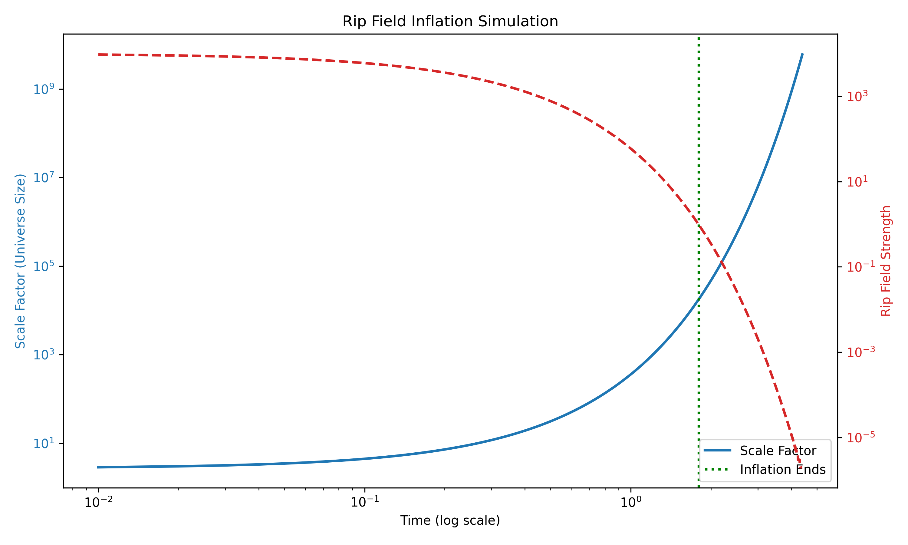

# Rip Field Inflation Simulation

## Abstract

We simulate cosmic inflation driven by a decaying scalar "rip field." This field initially dominates the energy density, causing rapid exponential expansion of space. As the rip field decays exponentially, inflation ends and a normal expansion phase begins. Our simulation, implemented in Rust and visualized with Python, demonstrates the growth of the scale factor and the decay of the rip field strength over time.

## Introduction

Cosmic inflation is theorized to solve several cosmological problems, including the horizon problem, flatness problem, and the origin of cosmic structure. In this work, we model inflation driven by a hypothetical rip field, whose exponential decay controls the inflation period and the transition to a slower, post-inflationary expansion.

## Methodology

The simulation uses a scalar rip field with the following behavior:

- **Rip field decay:**
\[
\text{rip}(t) = \text{rip}_0 \times e^{-\lambda t}
\]

- **Expansion rate:**
\[
H(t) = \sqrt{\text{rip}(t)}
\]

- **Scale factor growth:**
\[
a(t) = \exp\left(\int H(t) dt\right)
\]

### Simulation Details

- **Language:** Rust (simulation core)
- **Output:** CSV file containing `time`, `rip_strength`, and `scale_factor`
- **Visualization:** Python (matplotlib) for plotting and animating results

The simulation initializes the rip field to a high value, allowing the universe to expand rapidly. As the rip field decays exponentially, the expansion rate slows, ending the inflationary phase.

## Results

- The **scale factor** increases exponentially during the inflationary period.
- The **rip field strength** decays smoothly over time.
- Inflation ends naturally when the rip field strength falls below a critical threshold.
- Visualizations include static plots and dynamic GIF animations illustrating the inflation process.

### Visualization Outputs

**Static Plot: Scale Factor and Rip Strength**

<p>
  
</p>

- **Description:**
  This plot shows the scale factor (universe size) and the rip field strength over time on a log-log scale. A green dotted line marks the end of inflation where the rip field falls below a critical threshold.  

**Animated Inflation:**
<p>
  
</p>
- **File:** `assets/inflation_animation.gif`
- **Description:**
  This GIF animates the growth of the scale factor over time, starting from early inflation to the end of rapid expansion. The animation visually captures the exponential nature of early-universe inflation.

## Conclusion

The rip field model successfully produces a period of rapid exponential expansion followed by a natural exit from inflation. Future work will include modeling quantum fluctuations during inflation and simulating the reheating phase where matter and radiation are generated.

## Project Structure

- `src/main.rs`: Rust simulation code
- `data/`: Simulation CSV output
- `scripts/`: Python scripts for plotting and animating
- `assets/`: Saved plots and animations

## Quick Start

1. Run the Rust simulation:

```bash
cargo run
```

2. Generate plots:

```bash
python scripts/plot_simulation.py
```

3. Create animations:

```bash
python scripts/animate_inflation.py
```

## Requirements

- Rust and Cargo
- Python 3.x
- Python packages:

```bash
pip install pandas matplotlib pillow
```

